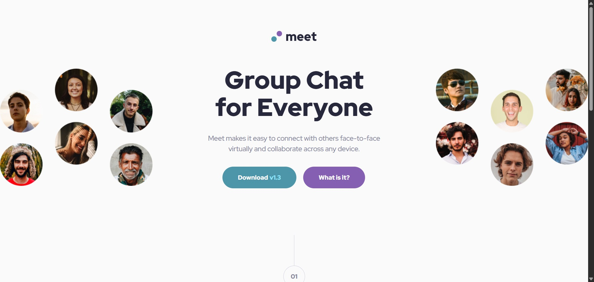

# Frontend Mentor - Meet landing page solution

This is a solution to the [Meet landing page challenge on Frontend Mentor](https://www.frontendmentor.io/challenges/meet-landing-page-rbTDS6OUR). Frontend Mentor challenges help you improve your coding skills by building realistic projects.

## Table of contents

- [Overview](#overview)
  - [The challenge](#the-challenge)
  - [Screenshot](#screenshot)
  - [Links](#links)
- [My process](#my-process)
  - [Built with](#built-with)
  - [What I learned](#what-i-learned)
  - [Continued development](#continued-development)
  - [Useful resources](#useful-resources)
  - [AI Collaboration](#ai-collaboration)
- [Author](#author)
- [Acknowledgments](#acknowledgments)

## Overview

### The challenge

Users should be able to:

- View the optimal layout depending on their device's screen size
- See hover states for interactive elements

### Screenshot



### Links

- Solution URL: [https://github.com/runny-life/meta-landing-page](https://github.com/runny-life/meta-landing-page)
- Live Site URL: [https://runny-life.github.io/meta-landing-page/](https://runny-life.github.io/meta-landing-page/)

## My process

### Built with

- Semantic HTML5 markup
- CSS custom properties (variables)
- Flexbox
- CSS Grid
- Mobile-first workflow
- BEM naming methodology
- Responsive images with `srcset` and `picture` elements
- Clamp() for fluid typography and spacing
- CSS `@import` for modular architecture

### What I learned

Working on this project reinforced several key concepts and introduced some useful techniques:

**1. Fluid Typography and Spacing with `clamp()`**

I used `clamp()` extensively to create responsive values without needing multiple breakpoints for every property:

```css
.text-preset-1 {
  font-size: clamp(2.5rem, 1.633rem + 3.698vw, 4rem);
}

.gallery {
  gap: clamp(1rem, 0.422rem + 2.465vw, 2rem);
}
```

This approach ensures smooth scaling between mobile and desktop sizes while maintaining readability.

**2. BEM (Block Element Modifier) Naming Convention**

I structured the CSS using BEM methodology to keep the code clean and maintainable:

```html
<div class="hero__image-wrapper">
  
</div>
```

```css
.hero__image {
}
.hero__image--left {
}
.link-button--cyan {
}
```

This makes it easy to understand the relationships between elements and reduces specificity conflicts.

**3. CSS Cascade and `@import` Organization**

I organized the CSS into a modular structure using `@import`:

```css
/* Base */
@import url("./base/variables.css");
@import url("./base/normalize.css");
@import url("./base/fonts.css");
@import url("./base/base.css");
@import url("./base/typography.css");
/* Components */
@import url("./components/link-button.css");
@import url("./components/section-number.css");
@import url("./components/gallery.css");
@import url("./components/tag.css");
/* Layout */
@import url("./layout/header.css");
@import url("./layout/hero.css");
@import url("./layout/advantages.css");
@import url("./layout/footer.css");
```

This separation of concerns makes the codebase easier to navigate and maintain.

**4. Responsive Images with Different Art Directions**

The hero section uses different image sources for different device sizes:

```html


```

The desktop version displays two separate hero images on the sides, while mobile/tablet shows a single centered image.

**5. CSS Grid for Gallery Layout**

The gallery uses CSS Grid to create a responsive layout that changes from 2 columns on mobile to 4 columns on tablet:

```css
.gallery {
  display: grid;
  grid-template-columns: repeat(2, 1fr);
  gap: clamp(1rem, 0.422rem + 2.465vw, 2rem);
}

@media (min-width: 768px) {
  .gallery {
    grid-template-columns: repeat(4, 1fr);
  }
}
```

**6. Decorative Elements with Pseudo-elements**

I used `::before` pseudo-elements to create the decorative lines connecting section numbers:

```css
.section-number::before {
  content: "";
  position: absolute;
  bottom: 100%;
  left: 50%;
  transform: translateX(-50%);
  height: 5rem;
  width: 0.063rem;
  background-color: var(--slate-300);
}
```

**7. Text Balance with `text-wrap: balance`**

Modern CSS feature to prevent orphaned words in headings:

```css
h1,
h2,
h3,
h4 {
  text-wrap: balance;
}
```

**8. Accessibility Considerations**

- Used `aria-labelledby` and `aria-describedby` to associate sections with their headings
- Added descriptive `alt` text for images
- Used `loading="lazy"` for off-screen images to improve performance
- Maintained proper heading hierarchy (h1 → h2)

### Continued development

In future projects, I want to continue focusing on:

- **Advanced responsive image techniques** - Implementing `srcset` with `sizes` attributes for optimal image delivery
- **CSS custom properties** - Further exploring dynamic theming and more sophisticated use of CSS variables
- **Performance optimization** - Implementing critical CSS and lazy loading strategies
- **Accessibility** - Deeper understanding of ARIA attributes and semantic HTML for screen readers
- **CSS Grid and Subgrid** - Exploring more complex grid layouts and subgrid capabilities
- **Animation and transitions** - Adding subtle micro-interactions for improved user experience

### Useful resources

- [MDN Web Docs - clamp()](https://developer.mozilla.org/en-US/docs/Web/CSS/clamp) - Essential resource for understanding the `clamp()` function for fluid responsive values.
- [CSS Tricks - A Complete Guide to Grid](https://css-tricks.com/snippets/css/complete-guide-grid/) - Comprehensive reference for CSS Grid layout.
- [BEM 101](https://css-tricks.com/bem-101/) - Great introduction to the BEM methodology.
- [Frontend Mentor Community](https://www.frontendmentor.io/community) - Helpful for seeing other solutions and getting feedback.
- [text-wrap: balance](https://developer.mozilla.org/en-US/docs/Web/CSS/text-wrap) - Modern CSS property for better typography.

### AI Collaboration

During this project, I used AI tools to enhance my workflow:

- **Tools used:** Claude AI (through the web interface)
- **How I used them:**
  - **Planning and architecture:** Discussed the component structure and CSS organization approach before writing code
  - **Debugging:** Identified and resolved layout issues, particularly with the hero section's responsive behavior
  - **CSS best practices:** Received suggestions on using `clamp()` for fluid typography and spacing
  - **Code review:** Had the AI review my code for potential improvements in accessibility and semantics
- **What worked well:** The AI was particularly helpful with CSS architecture decisions and explaining responsive design patterns. It provided clear explanations of why certain approaches work better than others.
- **What didn't work well:** Occasionally, the AI suggested solutions that were overly complex for the problem at hand, requiring me to simplify based on project needs.

## Author

- Frontend Mentor - [@runny-life](https://www.frontendmentor.io/profile/yourusername)
- GitHub - [@runny-life](https://github.com/runny-life)

## Acknowledgments

Special thanks to Frontend Mentor for providing this challenge and the design assets. The challenge was an excellent opportunity to practice responsive design and CSS architecture.

Thanks to the Frontend Mentor community for the inspiration and feedback on similar projects.
